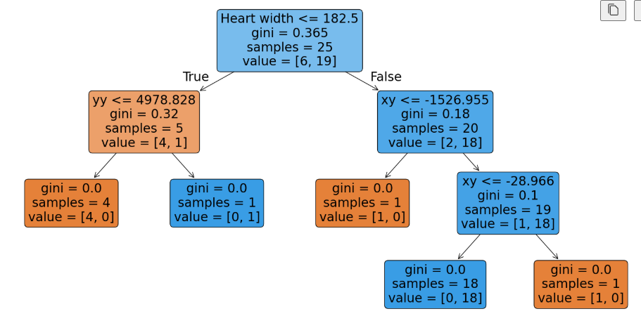
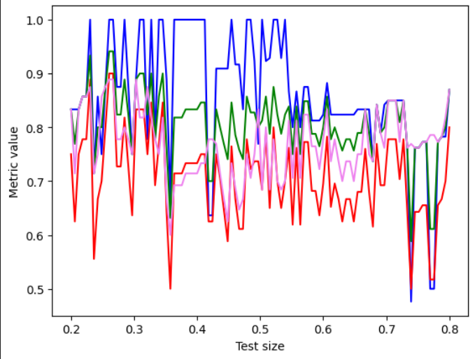
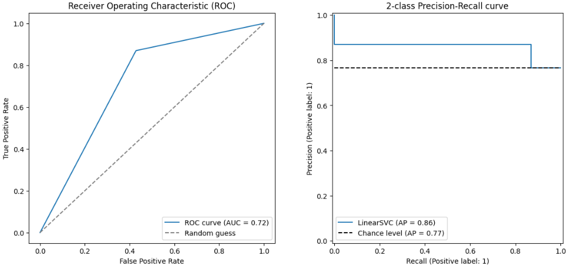
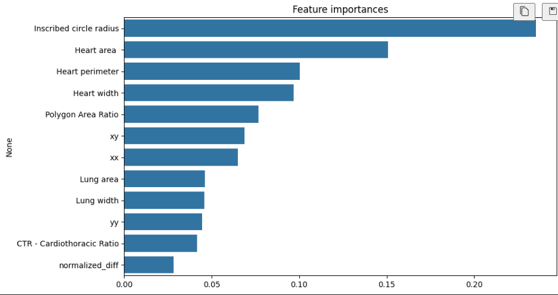
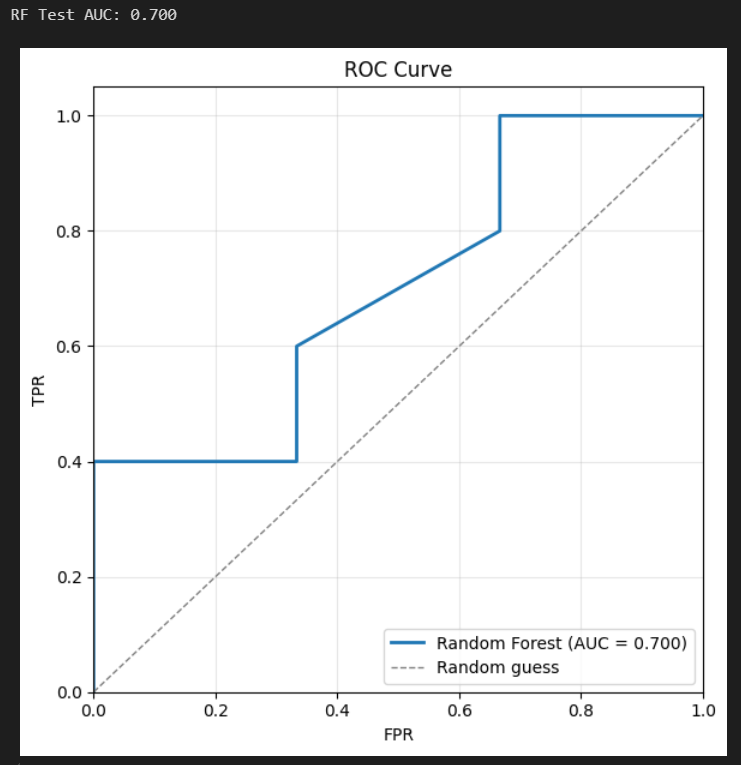
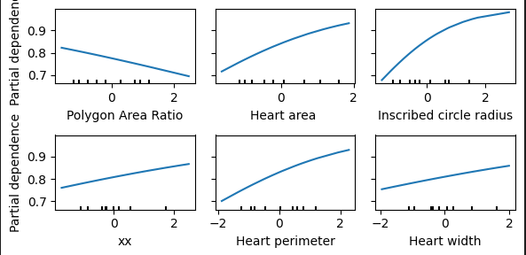
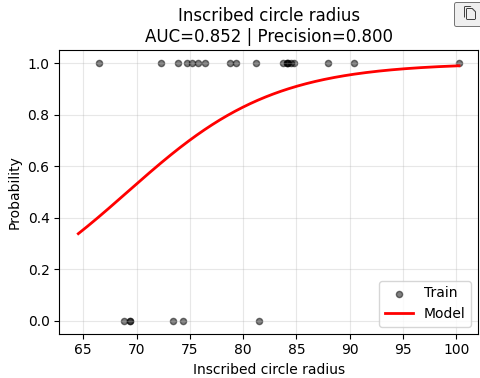
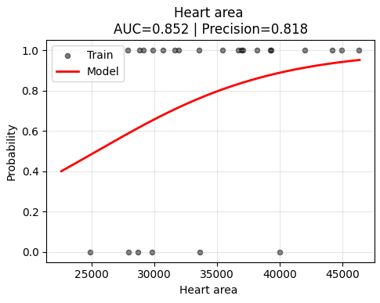
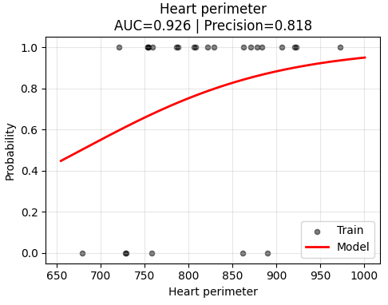

## AI_MED Recruitment Project

Below are three models that I created for classifying if the heart is healthy given certain semi-correlated parameters.

# 1. Decision Trees

Key steps I've done:
- loaded, cleaned and processed the data, so the numeric values are consistent and meaningful characteristics stay in one place,
- split data into train and test sets,
- created a classifier, but also tested which parameters will fit it the best and later on visualized the results,



- tested quality metrics such as precision, f1-score, recall to check if the model predicts correctly and doesn't make random guesses,

```
Recall:  1.0
Accuracy:  0.9166666666666666
F1-score:  0.9473684210526315
Precision:  0.9
Confusion Matrix: 
 [[2 1]
 [0 9]]
```

- loop-checked if changing test sizes will affect the model predictions,



- visualized ROC and 2-class Precision-Recall curves,



side notes:
- the notebook has most of the explanation included after each major computation,
- this is my most "Run All"ed and tested solution, so there might be slight discrepancies between the numbers, but I kept the reasoning consitent so it sticks to the main idea.

I am skipping the setup part when describing next models, because it's basically the same throughout them all.

# 2. Random Forest

Key steps:
- created 2 RF classfiers to check if default parameters will work better than the initialized ones, but the classification report has shown basically no difference,
```  
precision    recall  f1-score   support

           0       1.00      0.33      0.50         3
           1       0.71      1.00      0.83         5

    accuracy                           0.75         8
   macro avg       0.86      0.67      0.67         8
weighted avg       0.82      0.75      0.71         8 
```

- bar chart has shown data from the most to least significant



- visualized ROC curve 




# 3. Logistic Regression

This is the part when we see that the models play the same game and similarities in results start to appear.

Key steps:
- applied StandardScalar to standarize all features,
- divided the solution into two approaches: 1 - finding significant features when the model considers them all at the same time; 2 - working on the features seperately (in other words - one model per feature)
- in approach 1 I included PartialDependenceDisplay to show how much each feature acutally changes the prediction - even when others are involved (the x-axes show values in standard deviation units: 
    - -2 = 2 SD below average,
    - 0 = average,
    - +2 = 2 SD above average)



- results from 2nd approach show basically the same curves as in previous the plots, but we also have the AUC and precision values







Finally, results from the Random Forest bar chart resemble Logistic Regression curves and explain steepness and range of each significant one. Inscribed circle radius, Heart area and Heart perimeter which contribute to the classification the most.

Final thoughts: 
- Looking back at Decision Trees, we clearly can see that some nodes don't quite match the features mentioned above, but it might be expectable as the dataset is reall small and a little imbalance might appear at some point. 
- Dataset size also play role when it comes to quality metrics, because they are sometimes very positive, but sometimes their value drops by a bit. 
- Nonetheless, three of those classification models seem to be working along quite nicely as they present very simillar results and predict with an accuracy much bigger than random guessing.
